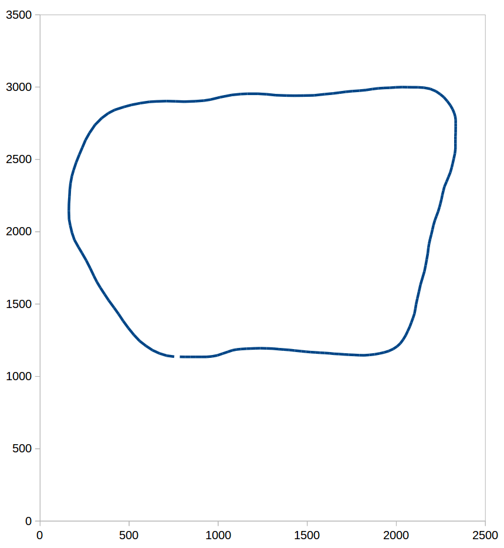

# CarND-Path-Planning-Project
Self-Driving Car Engineer Nanodegree Program

### Simulator
You can download the Term3 Simulator which contains the Path Planning Project from the [releases tab](https://github.com/udacity/self-driving-car-sim/releases).

### Goals
In this project your goal is to safely navigate around a virtual highway with other traffic that is driving +-10 MPH of the 50 MPH speed limit. You will be provided the car's localization and sensor fusion data, there is also a sparse map list of waypoints around the highway. The car should try to go as close as possible to the 50 MPH speed limit, which means passing slower traffic when possible, note that other cars will try to change lanes too. The car should avoid hitting other cars at all cost as well as driving inside of the marked road lanes at all times, unless going from one lane to another. The car should be able to make one complete loop around the 6946m highway. Since the car is trying to go 50 MPH, it should take a little over 5 minutes to complete 1 loop. Also the car should not experience total acceleration over 10 m/s^2 and jerk that is greater than 50 m/s^3.

## Details
1. The car uses a perfect controller and will visit every (x,y) point it recieves in the list every .02 seconds. The units for the (x,y) points are in meters and the spacing of the points determines the speed of the car. The vector going from a point to the next point in the list dictates the angle of the car. Acceleration both in the tangential and normal directions is measured along with the jerk, the rate of change of total Acceleration. The (x,y) point paths that the planner recieves should not have a total acceleration that goes over 10 m/s^2, also the jerk should not go over 50 m/s^3. (NOTE: As this is BETA, these requirements might change. Also currently jerk is over a .02 second interval, it would probably be better to average total acceleration over 1 second and measure jerk from that.

2. There will be some latency between the simulator running and the path planner returning a path, with optimized code usually its not very long maybe just 1-3 time steps. During this delay the simulator will continue using points that it was last given, because of this its a good idea to store the last points you have used so you can have a smooth transition. previous_path_x, and previous_path_y can be helpful for this transition since they show the last points given to the simulator controller with the processed points already removed. You would either return a path that extends this previous path or make sure to create a new path that has a smooth transition with this last path.

## Implementation
[`cPathPlanner`](src/path_planner.h) acts as the main interface for the simulator. It receives updates from the simulator in its `Execute(...)` function and returns a path that was generated based on the content provided by the simulator.
cPathPlanner contains the major components

- [`cWaypointMap`](src/waypoint_map.h): a container for the waypoints from `data/highway_map.csv`, it provides conversion from Frenet to Cartesian coordinates
- [`cSensorFusion`](src/sensor_fusion.h): processes information about other traffic participants, e.g. leading vehicle in current lane or vehicles in neighbor lanes
- [`cBehaviorPlanner`](src/behavior_planner.h): determines the next action based on the information provided by sensor fusion
- [`cTrajectoryPlanner`](src/trajectory_planner.h): generates a path based on the information provided by the behavior planner

The individual components are described in more detail in the following sections.

### cWaypointMap
The map of the highway is in data/highway_map.csv. Each waypoint in the list contains [x, y, s, dx, dy] values. x and y are the waypoint's map coordinate position, the s value is the distance along the road to get to that waypoint in meters, the dx and dy values define the unit normal vector pointing outward of the highway loop.

The highway's waypoints loop around so the frenet s value, distance along the road, goes from 0 to 6945.554.



The function [`ReadMapFile()`](src/waypoint_map.cpp) reads the content of `data/highway_map.csv` and creates splines for smoother conversion from Frenet to Cartesian coordinates. The image above shows that there is a gap between the last and the first waypoint of the track. To fill this gap, the first given waypoint is copied to the end of the list to enable a smooth transition from end to beginning of track.

The conversion from Frenet to Cartesian coordinates is implemented in [`CartesianPosition(...)`](src/waypoint_map.cpp). The calculation is done based on the spline-interpolated values of x, y, dx, dy.

The spline interpolation uses code from [Cubic Spline interpolation in C++](http://kluge.in-chemnitz.de/opensource/spline/) which proved to be a really helpful ressource.

### cSensorFusion
The main logic of [`cSensorFusion`](src/sensor_fusion.cpp) is concerned with sorting the received information about other vehicles into the corresponding lanes and querying the lanes regarding the position of the vehicles relative to the position of the ego vehicle.

[`cSensorFusion`](src/sensor_fusion.cpp) receives via [`Execute(...)`](src/sensor_fusion.cpp) information about other vehicles (e.g. their speed and coordinates) from [`cPathPlanner`](src/path_planner.h). The vehicles are then sorted based on their `d` coordinate into the corresponding lane.

Each lane is represented by a [`cLaneInfo`](src/lane_info.h) that acts as a container for the vehicles of that lane. `cSensorFusion` delegates queries to its `cLaneInfo` members for the left, middle and right lane to check whether a particular lane interval is free or already occupied by another vehicle.

Each [`cLaneInfo`](src/lane_info.h) instance maintains a list of vehicles that is sorted by their distance to the ego vehicle. The stored information can be accessed by these functions:

- `IsLeadingVehicleAhead()` and `LeadingVehicleDistance()` to get information about the next vehicle ahead of the ego position
- `IsLaneBlocked(...)` to check whether there is a vehicle laterally close to the ego position

### cBehaviorPlanner
The execution of the behavior planner is triggered by its [`Execute(...)`](src/behavior_planner.cpp) function where `cBehaviorPlanner` receives the current information about the ego vehicle from `cPathPlanner`. Based on the received information, it queries `cSensorFusion` to determine the next feasible action that is represented by a `sBehavior` instance and that is later used by `cTrajectoryPlanner` to generate a path.

I didn't implement a finite state machine explicitly, instead the behavior is planned ad-hoc depending on the current lane the ego vehicle is in and the information from `cSensorFusion`:

- if the vehicle is in the left lane, it can only stay in that lane or change right to the middle lane
- if the vehicle is in the middle lane, it can stay in that lane or change to the left or right lane
- from the right lane the vehicle can change left to the middle lane or stay on the right lane         

Depending on the current lane, the neighbor lanes are checked via `cSensorFusion` if a lane change is possible. If this is the case, a [`sBehavior`](src/behavior.h) instance is created that has the lane set as it's target lane. This is implemented in the `PossibleBehaviors(...)` and `CheckNeighborLanes(...)` functions.

The generated set of possible behaviors is then processed by `LowestCostBehavior(...)` to find the optimal behavior. I implemented the following cost functions:

- `PenaltyLaneChange(...)`: adds a constant cost for lane changes (if target lane differs from current lane) to avoid unnecessary lane changes
- `PenaltyNotOnMiddleLane(...)`: adds a constant cost if the ego vehicle is not on the middle lane to favor driving on the middle lane because from the middle lane, the left and right lane can be used to overtake slower vehicles
- `PenaltySpeed(...)`: adds a proportional cost based on difference of leading vehicle speed to maximum speed to avoid following slow vehicles
- `PenaltyDistance(behavior)`: adds a proportional cost based on distance to the leading vehicle to avoid changing to a lane where the distance to the leading vehicle is smaller
- `PenaltyCollision(behavior)`: adds a constant (highest) cost if the behavior would lead to a collision

After selecting the lowest cost behavior, `sBehavior` contains the following information that is used to generate the new path:

- `adaptSpeedToLeadingVehicle`: true if the speed shall be adapted to the leading vehicle speed
- `targetSpeed`: the desired speed for the ego vehicle
- `targetLane`: in case of a lane change, the target lane

The selected behavior is used in the next step to generate a path.

### cTrajectoryPlanner
A new path is generated in [`GenerateTrajectory(...)`](src/trajectory_planner.cpp). The path is generated based on the current state of the ego vehicle (speed, lateral/longitudinal position), the given behavior and the previous path. Four ways of generating a new path are implemented:

 - `Startup(...)`: if the given previous path is empty, a path is generated that accelerates to maximum speed within the current lane
 - `KeepLane(...)`: if the state of the behavior is "keep lane" and no leading vehicle is ahead, a path is generated that follows the current lane with maximum speed
 - `AdaptSpeedToLeadingVehicle()`: if there is a leading vehicle in the current lane, a path is generated that adapts the speed to the leading vehicle's speed
 - `LaneChange(...)`: if the state of the behavior is "change left|right" a path is generated that transitions to the target lane

The functions are based on the provided starter code and use the same scheme to generate the path:

1. find an anchor point in world (Cartesian) coordinates based on the current position and previous path (not available in `Startup(...)`)
2. generate 1-3 additional reference points in world coordinates that are farther ahead of the vehicle with the help of Frenet coordinates
3. transform these world reference points into local coordinates
4. create a spline to interpolate path points between the reference points in local coordinates
5. transform the interpolated points from local coordinates back to world coordinates
6. append world coordinate path points to the given previous path

#### AdaptSpeedToLeadingVehicle
Paths are generated with [`AdaptSpeedToLeadingVehicle(...)`](src/trajectory_planner.cpp) if the ego vehicle has to follow a vehicle (e.g. if the neighbor lanes are blocked by other vehicles). In this situation it is important to quickly adapt to speed changes of the leading vehicle and also to maintain a safety distance. To achieve this, only a small portion of 10 points of the previous path is reused. With an average cycle time of 0.02 s this means, that the speed can be adapted every 0.2 seconds.

The code is listed below:

``` c++
std::vector<sPoint2D> cTrajectoryPlanner::AdaptSpeedToLeadingVehicle(
    const sBehavior& behavior,
    const sEgo& ego,
    sPath& previousPath)
{
    assert(previousPath.points.size() >= replanBufferFollowVehicle);

    // replanBufferFollowVehicle: reuse 10
    // points from previous path
    std::vector<sPoint2D> reusedPath(
        previousPath.points.begin(),
        previousPath.points.begin() + replanBufferFollowVehicle);

    // use last point from replan buffer as anchor
    // for transformation to local coordinates
    const auto& pt0 = reusedPath[replanBufferFollowVehicle - 2];
    const auto& refPt = reusedPath[replanBufferFollowVehicle - 1];
    const auto refAngle = atan2(refPt.y - pt0.y, refPt.x - pt0.x);
    const auto reusedPathLength = PathLength(reusedPath);

    // create reference points in world coordinates
    // from previous path
    vector<sPoint2D> referencePointsWorld;
    referencePointsWorld.emplace_back(reusedPath[0]);
    referencePointsWorld.emplace_back(
        reusedPath[replanBufferFollowVehicle - 1]);

    // generate world reference points 30, 60 and 90 meters
    // ahead in the same lane
    const auto pathEnd = ego.s + reusedPathLength;
    AppendPlanningPoints(referencePointsWorld,
        LaneNameToD(behavior.targetLane),
        { pathEnd + 30, pathEnd + 60, pathEnd + 90 });

    // convert world reference points to local coordinates
    const auto referencePointsLocal = TransformToLocalCoordinates(
        refPt, refAngle, referencePointsWorld);

    const auto v0 = Distance(refPt, pt0) / cycleTime;
    auto targetV = behavior.targetSpeed;

    // check safety distance and fall back if necessary
    if (behavior.leadingVehicle.sDistanceEgo < safetyDistance)
    {
        targetV -= (2.0 * cycleTime * accelAdaptSpeed);
    }

    // interpolate path points with a spline in local coordinates
    const auto deltaV = targetV - v0;
    vector<sPoint2D> samplePointsLocal;
    const auto missingPathPoints = numPathPoints - replanBufferFollowVehicle;
    if (deltaV >= 0)
    {
        SampleSplineAccelerate(referencePointsLocal, samplePointsLocal,
            v0, targetV, accelAdaptSpeed, missingPathPoints);
    }
    else
    {
        SampleSplineDecelerate(referencePointsLocal, samplePointsLocal,
            v0, targetV, accelAdaptSpeed, missingPathPoints);
    }

    // transform interpolated path points to world coordinates
    const auto samplePointsWorld = TransformToWorldCoordinates(
        refPt, refAngle, samplePointsLocal);

    // append to previous path
    const auto numSamplePoints = samplePointsWorld.size();
    for (auto i = 0; i < numSamplePoints; ++i)
    {
        reusedPath.emplace_back(samplePointsWorld[i]);
    }

    return reusedPath;
}
```

The other path generation functions are implemented in a similar fashion, they differ only in details, `LaneChange(...)` for example uses a larger spacing for the generated reference points to avoid jerk violations.  

## Reflection
The path planning project was the most challenging project in the SDC ND program so far. It took a lot of time to try out the possible approaches, e.g. to use JMTs. I also tried to implement a prediction module and to calculate the expected jerk, but did not succeed in that.

I implemented the code on a dual boot machine with Windows 10 and Linux Mint 18 and observed that the same code behaves differently on both OS: it seems that it's harder to complete a lap successfully with Windows than with Linux - the acceleration limit is violated more often. The following screenshot shows that the implementation runs quite stable under Linux:

  

The first acceleration violation happened in the 8th lap after after 25 miles.

### Achieved results
A video of a successful run can be found here:
<a href="http://www.youtube.com/watch?feature=player_embedded&v=Ki778Ix7bqM" target="_blank">
  
</a>

Known deficiencies:

- The current implementation switches lanes quite often - or at least tries to.
  - this caused for e.g. the acceleration failure in the long running video.
  - another related problem is, that the vehicle could constantly drive on two lanes while not being able to decide which to take - this would cause an "out-of-lane" failure.
    - This could hopefully be addressed by fine tuning the cost values.
- Another issue is that spline interpolation for the outer or right lane seems to be imprecise. I therefore decreased the d value by 0.2 m for the right lane as a quick fix in [`LaneNameToD(...)`](src/lane_info.cpp).
  - I assume this could be fixed by creating separate splines for each lane.

The rubric points have hopefully been addressed.

## Basic Build Instructions

1. Clone this repo.
2. Make a build directory: `mkdir build && cd build`
3. Compile: `cmake .. && make`
4. Run it: `./path_planning`.

Here is the data provided from the Simulator to the C++ Program

#### Main car's localization Data (No Noise)

["x"] The car's x position in map coordinates

["y"] The car's y position in map coordinates

["s"] The car's s position in frenet coordinates

["d"] The car's d position in frenet coordinates

["yaw"] The car's yaw angle in the map

["speed"] The car's speed in MPH

#### Previous path data given to the Planner

//Note: Return the previous list but with processed points removed, can be a nice tool to show how far along
the path has processed since last time.

["previous_path_x"] The previous list of x points previously given to the simulator

["previous_path_y"] The previous list of y points previously given to the simulator

#### Previous path's end s and d values

["end_path_s"] The previous list's last point's frenet s value

["end_path_d"] The previous list's last point's frenet d value

#### Sensor Fusion Data, a list of all other car's attributes on the same side of the road. (No Noise)

["sensor_fusion"] A 2D vector of cars and then that car's [car's unique ID, car's x position in map coordinates, car's y position in map coordinates, car's x velocity in m/s, car's y velocity in m/s, car's s position in frenet coordinates, car's d position in frenet coordinates.

## Tips

A really helpful resource for doing this project and creating smooth trajectories was using http://kluge.in-chemnitz.de/opensource/spline/, the spline function is in a single hearder file is really easy to use.

---

## Dependencies

* cmake >= 3.5
 * All OSes: [click here for installation instructions](https://cmake.org/install/)
* make >= 4.1
  * Linux: make is installed by default on most Linux distros
  * Mac: [install Xcode command line tools to get make](https://developer.apple.com/xcode/features/)
  * Windows: [Click here for installation instructions](http://gnuwin32.sourceforge.net/packages/make.htm)
* gcc/g++ >= 5.4
  * Linux: gcc / g++ is installed by default on most Linux distros
  * Mac: same deal as make - [install Xcode command line tools]((https://developer.apple.com/xcode/features/)
  * Windows: recommend using [MinGW](http://www.mingw.org/)
* [uWebSockets](https://github.com/uWebSockets/uWebSockets)
  * Run either `install-mac.sh` or `install-ubuntu.sh`.
  * If you install from source, checkout to commit `e94b6e1`, i.e.
    ```
    git clone https://github.com/uWebSockets/uWebSockets
    cd uWebSockets
    git checkout e94b6e1
    ```

## Editor Settings

We've purposefully kept editor configuration files out of this repo in order to
keep it as simple and environment agnostic as possible. However, we recommend
using the following settings:

* indent using spaces
* set tab width to 2 spaces (keeps the matrices in source code aligned)

## Code Style

Please (do your best to) stick to [Google's C++ style guide](https://google.github.io/styleguide/cppguide.html).

## Project Instructions and Rubric

Note: regardless of the changes you make, your project must be buildable using
cmake and make!


## Call for IDE Profiles Pull Requests

Help your fellow students!

We decided to create Makefiles with cmake to keep this project as platform
agnostic as possible. Similarly, we omitted IDE profiles in order to ensure
that students don't feel pressured to use one IDE or another.

However! I'd love to help people get up and running with their IDEs of choice.
If you've created a profile for an IDE that you think other students would
appreciate, we'd love to have you add the requisite profile files and
instructions to ide_profiles/. For example if you wanted to add a VS Code
profile, you'd add:

* /ide_profiles/vscode/.vscode
* /ide_profiles/vscode/README.md

The README should explain what the profile does, how to take advantage of it,
and how to install it.

Frankly, I've never been involved in a project with multiple IDE profiles
before. I believe the best way to handle this would be to keep them out of the
repo root to avoid clutter. My expectation is that most profiles will include
instructions to copy files to a new location to get picked up by the IDE, but
that's just a guess.

One last note here: regardless of the IDE used, every submitted project must
still be compilable with cmake and make./
